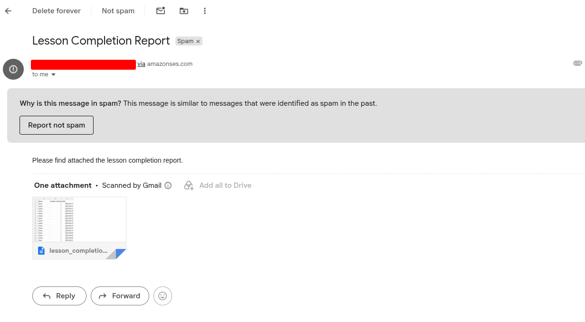

# Mindtickle Lesson Completion Report Generator

## 📋 Overview

This project automates the process of generating lesson completion reports for Mindtickle clients. It combines active user data from PostgreSQL with lesson completion records from MySQL, deduplicates entries, aggregates completions by user and date, and delivers the results via email with S3 backup storage.

## ✨ Key Features

- **Multi-source Data Aggregation**: Seamlessly combines data from PostgreSQL and MySQL databases
- **Deduplication**: Handles duplicate completion records intelligently using `completion_id`
- **Daily Scheduling**: Automatically processes yesterday's data on a daily schedule
- **On-demand Reporting**: Support for ad-hoc date range queries via DAG parameters
- **Cloud Storage**: Automatic upload to AWS S3 with configurable bucket settings
- **Email Distribution**: Direct report delivery via AWS SES with CSV attachment
- **Error Resilience**: Built-in retry logic and comprehensive error handling
- **Production-Ready**: Containerized with Docker for consistent deployment
- **Modular Design**: Clean separation of concerns across helper modules

## 🏗️ Architecture

### System Components

```
┌─────────────────────────────────────────────────────────┐
│                    Airflow Scheduler                     │
└──────────┬──────────────────────────────────────────────┘
           │
           ├─── PostgreSQL (Active Users) ──→ │
           │                                  ├─→ build_report Task
           └─── MySQL (Completions) ────────→ │
                                              │
                                         Aggregation
                                              │
                                              ↓
                                    CSV Report Generation
                                              │
                        ┌─────────────────────┼─────────────────────┐
                        │                     │                     │
                        ↓                     ↓                     ↓
                Local Reports Dir         AWS S3                  AWS SES
                   (airflow/reports/)     (upload)              (email)
```

### Technology Stack

- **Orchestration**: Apache Airflow 2.10.3
- **Data Processing**: Polars (high-performance data frames)
- **Databases**: PostgreSQL, MySQL
- **Cloud Services**: AWS S3, AWS SES
- **Containerization**: Docker, Docker Compose
- **Language**: Python 3.x

## 📊 Data Flow

### Scheduled Execution (Daily)

1. **Trigger**: DAG automatically runs daily (00:00 UTC)
2. **Fetch Active Users**: Query PostgreSQL for active users
3. **Fetch Completions**: Query MySQL for lesson completions from the previous day
4. **Deduplicate**: Remove duplicate entries using `completion_id`
5. **Aggregate**: Group completions by user and date, counting lessons per user per day
6. **Generate CSV**: Create report with columns: `Name`, `Number of lessons completed`, `Date`
7. **Save Locally**: Store report in `airflow/reports/`
8. **Upload**: Push report to S3 bucket
9. **Email**: Send report as attachment via SES

### Ad-hoc Execution (Manual)

Trigger the DAG via Airflow UI with parameters:
```json
{
  "start_date": "2026-06-01",
  "end_date": "2026-06-15"
}
```

This generates a report for the inclusive date range without automatic scheduling.

## 🎯 Design Choices

### 1. **Polars for Data Processing**
- Significantly faster than Pandas for large datasets
- Memory-efficient handling of multi-source joins
- Cleaner syntax for complex aggregations

### 2. **Deduplication Strategy**
- Uses `completion_id` as primary key to identify duplicate records
- Handles edge cases like multiple lessons per user per day
- Prevents inflated metrics in reports

### 3. **Environment Configuration**
- All sensitive credentials stored in `.env` files
- Never committed to version control
- Supports both local and containerized deployments

### 4. **Error Handling & Retry Logic**
- Automatic retry on failures (1 retry with 5-minute delay)
- Email notifications on task failures
- Comprehensive error messages for debugging

### 5. **Modular Helper Structure**
- `config.py`: Environment management and database connections
- `database.py`: Data fetching and aggregation logic
- `report.py`: CSV generation
- `storage.py`: S3 upload operations
- `notifications.py`: SES email delivery

## 🚀 Quick Start

> ⚠️ **IMPORTANT**: Before proceeding, review the [Configuration](#-configuration) section to understand all required environment variables in `.env`.

### Prerequisites

- Docker Desktop installed and running ([Install Docker](https://docs.docker.com/desktop/))
- Docker Compose ([Install Docker Compose](https://docs.docker.com/compose/install/))
- AWS credentials for S3 and SES

### Setup & Launch

1. **Clone the repository:**
   ```bash
   cd /home/albert/Documents/assignment
   ```

2. **Create environment configuration:**
   ```bash
   cp .env.example .env
   ```

3. **Volume permissions**: If you encounter permission errors with mounted volumes, prefer setting `AIRFLOW_UID` and `AIRFLOW_GID` in your `.env` so the container runs as the same host user. Add these lines to your `.env`, replacing the values with your host's UID/GID:
   ```bash
   AIRFLOW_UID=<your_uid>
   AIRFLOW_GID=<your_gid>
   ```

   Determine your host UID/GID with:
   ```bash
   id -u
   id -g
   ```

   If you do not set these, the container will use the image default user and you may need to adjust host directory ownership instead, for example:
   ```bash
   sudo chown -R $(id -u):$(id -g) airflow/logs airflow/reports
   ```

5. **Configure AWS credentials in `.env`:**
   ```
   AWS_REGION=us-east-1
   AWS_ACCESS_KEY_ID=your_access_key
   AWS_SECRET_ACCESS_KEY=your_secret_key
   S3_REPORT_BUCKET=your-bucket-name
   SES_SENDER=reports@yourdomain.com
   SES_RECIPIENTS=recipient1@example.com,recipient2@example.com
   ```

6. **Start all services:**
   ```bash
   docker compose -f docker-compose.airflow.yaml up --build
   ```

7. **Access Airflow UI:**
   - Navigate to `http://localhost:8080`
   - Use credentials defined in `.env`:
     ```
     AIRFLOW_ADMIN_USER=admin
     AIRFLOW_ADMIN_PASSWORD=admin
     AIRFLOW_ADMIN_FIRSTNAME=Admin
     AIRFLOW_ADMIN_LASTNAME=User
     AIRFLOW_ADMIN_EMAIL=admin@example.com
     ```

8. **Trigger the DAG:**
   - Find `mindtickle_daily_report` in the DAG list
   - Click the play button or navigate to trigger with custom parameters
   - For custom date range, use the JSON parameter editor:
     ```json
     {
       "start_date": "2026-06-01",
       "end_date": "2026-06-15"
     }
     ```

9. **Verify outputs:**
   - Check generated reports inside the Airflow container at `/opt/airflow/reports` (container path). To list files:

      ```bash
      docker compose exec airflow ls -la /opt/airflow/reports
      ```

      If you prefer to access reports on the host, set `REPORT_OUTPUT_DIR` in your `.env` to a host-mounted path before starting the stack.

   - Alternatively, inspect the named Docker volume `airflow_reports` and list its contents:

      ```bash
      docker volume inspect airflow_reports
      docker run --rm -v airflow_reports:/data alpine ls -la /data
      ```

   - Monitor S3 bucket for uploaded reports
   - Verify email delivery in SES sent items
   - Check recipient inbox spam/junk folders if the report does not appear in the main inbox

## 📂 Repository Structure

```
.
├── airflow/
│   ├── dags/
│   │   ├── mindtickle_daily_report.py      # Main DAG definition
│   │   └── helpers/
│   │       ├── __init__.py                 # Module exports
│   │       ├── config.py                   # Env & DB configuration
│   │       ├── database.py                 # Data fetching & aggregation
│   │       ├── report.py                   # CSV generation
│   │       ├── storage.py                  # S3 operations
│   │       └── notifications.py            # SES email delivery
│   ├── logs/                               # Airflow task execution logs
│   └── reports/                            # Generated CSV reports
├── setup/
│   ├── docker-compose.yaml                 # Database services
│   ├── Dockerfile-MySQL                    # MySQL image
│   ├── Dockerfile-PG                       # PostgreSQL image
│   ├── init.mysql.sql                      # MySQL sample data
│   └── init.pg.sql                         # PostgreSQL sample data
├── docker-compose.airflow.yaml             # Airflow + DB orchestration
├── Dockerfile-airflow                      # Airflow image
├── .env.example                            # Configuration template
├── requirements.txt                        # Python dependencies
├── problem.md                              # Assignment requirements
└── README.md                               # This file
```

## ⚙️ Configuration

### Environment Variables (`.env`)

**Database Configuration:**
```
POSTGRES_HOST=postgres
POSTGRES_PORT=5432
POSTGRES_DB=mindtickle_db
POSTGRES_USER=pg_user
POSTGRES_PASSWORD=pg_password

MYSQL_HOST=mysql
MYSQL_PORT=3306
MYSQL_DB=mindtickle_db
MYSQL_USER=mysql_user
MYSQL_PASSWORD=mysql_password
```

**AWS Configuration:**
```
AWS_REGION=us-east-1
AWS_ACCESS_KEY_ID=your_key
AWS_SECRET_ACCESS_KEY=your_secret
S3_REPORT_BUCKET=your-bucket-name
```

**SES Configuration:**
```
SES_SENDER=reports@yourdomain.com
SES_RECIPIENTS=user1@example.com,user2@example.com
```

**Airflow Configuration:**
```
AIRFLOW__CORE__EXECUTOR=SequentialExecutor
AIRFLOW__CORE__LOAD_EXAMPLES=False
AIRFLOW__WEBSERVER__WORKERS=2
AIRFLOW_ADMIN_USER=admin
AIRFLOW_ADMIN_PASSWORD=admin
AIRFLOW_ADMIN_FIRSTNAME=Admin
AIRFLOW_ADMIN_LASTNAME=User
AIRFLOW_ADMIN_EMAIL=admin@example.com
```

**Report Storage:**
```
REPORT_OUTPUT_DIR=/opt/airflow/reports
```

## 📝 Usage Examples

### Example 1: Scheduled Daily Report

The DAG automatically runs every day at midnight UTC and processes the previous day's lesson completions.

### Example 2: Generate Report for Custom Date Range

1. Open Airflow UI → Trigger DAG
2. Enter parameters to match sample data (2026-06-18 to 2026-06-20):
   ```json
   {
     "start_date": "2026-06-18",
     "end_date": "2026-06-20"
   }
   ```
3. Click "Trigger"
4. Report file: `lesson_completion_report_2026-06-18_2026-06-20.csv`

### Example 3: Generate Single-Day Historical Report

Parameters:
```json
{
  "start_date": "2026-06-19",
  "end_date": "2026-06-19"
}
```

> **Note**: The examples above use 2026 dates to match the sample data, but **any date range in YYYY-MM-DD format is supported**. The DAG will process whatever data exists in the databases for your specified date range.

## 📊 Report Output Format

**CSV Columns:**
- `Name`: User's full name
- `Number of lessons completed`: Count of unique lessons completed
- `Date`: Report date (YYYY-MM-DD format)

**Example:**
```csv
Name,Number of lessons completed,Date
John Doe,5,2026-06-20
Jane Smith,3,2026-06-20
Bob Johnson,7,2026-06-20
```

**Filename Pattern:**
```
lesson_completion_report_{start_date}_{end_date}.csv
```

**Storage Locations:**

- **Local**: `airflow/reports/lesson_completion_report_{start_date}_{end_date}.csv`
- **S3**: `s3://{S3_REPORT_BUCKET}/{S3_REPORT_PREFIX}/lesson_completion_report_{start_date}_{end_date}.csv`
  - The `S3_REPORT_PREFIX` is the **generation date** (YYYY-MM-DD format)
  - Example: `s3://mindtickle-reports/2026-06-20/lesson_completion_report_2026-06-20_2026-06-20.csv`
  - Configure bucket and prefix pattern in `.env.airflow`:
    ```
    S3_REPORT_BUCKET=mindtickle-reports
    S3_REPORT_PREFIX=reports  # Set to desired prefix or date pattern
    ```

## � Screenshots

### Airflow DAG Execution


### S3 Report Storage

Screenshots demonstrating S3 bucket organization and uploaded reports:


### Email Report Delivery

Screenshots showing the email delivery via AWS SES:



## �📦 Dependencies

All dependencies are managed via `requirements.txt` and automatically installed in the Docker image:

```
apache-airflow==2.10.3
apache-airflow-providers-amazon
apache-airflow-providers-mysql
apache-airflow-providers-postgres
mysql-connector-python
psycopg2-binary
boto3
polars
```


